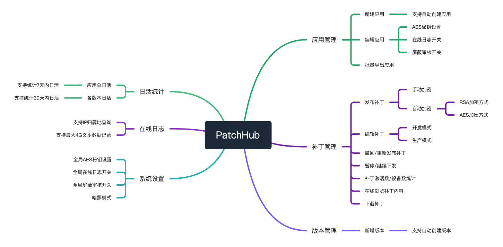

[](https://img.shields.io/cocoapods/v/MangoFixUtil.svg)
[](http://cocoadocs.org/docsets/MangoFixUtil)

## 项目简介

一个简单、好用、稳定的iOS热更新平台，目前能正常过审。
    
在中大型项目中经过多年实战迭代，能满足App日常的Bug修复、功能更新。

拥有一批忠实、活跃的老用户，最早2021年5月使用至今。

累计已服务 150+ AppStore应用。

## 主要功能

主要功能有 应用管理 | 版本管理 | 补丁管理 | 日活统计 | 在线日志 | 系统设置，具体如图：
  
<div align="center">
    
</div>

<br>

平台地址：https://patchhub.top/mangofix/login
<br>

Gitee：[https://gitee.com/xhg8131/mango-fix-util](https://gitee.com/xhg8131/mango-fix-util)
<br>

QQ群：1028778036
<br>

## 最近更新
- 2024.11.27: 新增代理方法 | 修复偶现补丁激活数大于设备数的问题 | 修复偶现补丁失效的问题

<br>
  
## 准备工作

### CocoaPods

推荐使用[CocoaPods](http://cocoapods.org)方式添加MangoFixUtil到您的项目中

```ruby
# Podfile
pod 'MangoFixUtil', '~> 2.1.6'
```

<br>

## 示例

```objc
@implementation AppDelegate

- (BOOL)application:(UIApplication *)application didFinishLaunchingWithOptions:(NSDictionary *)launchOptions {

    // 我们把初始化放在最前面，这样的好处是在该方法后面执行的代码都可以被修复
    [self setupMangoFixUtil];
    
    self.window = [[UIWindow alloc] initWithFrame:[UIScreen mainScreen].bounds];
    self.window.backgroundColor = [UIColor whiteColor];
    self.window.rootViewController = [[ViewController alloc] init];
    [self.window makeKeyAndVisible];
            
    return YES;
}

- (void)setupMangoFixUtil {
    
    [[MangoFixUtil startWithAppId:APPID aesKey:AES128KEY] evalRemoteMangoScript];
}

@end
```

注意：模拟器运行需用Rosetta方式

<br>

## Thanks for
[Mango](https://github.com/YPLiang19/Mango)
